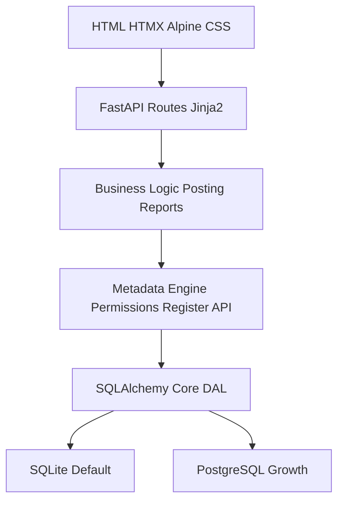
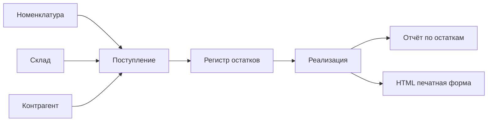

# Итоговая спецификация open-source ERP/учётной системы

## 1. Назначение продукта

Разработать open-source веб-систему для торгово-складского и управленческого учёта малого бизнеса. Продукт должен запускаться на SQLite одной командой, поддерживать PostgreSQL для роста, иметь developer-first расширяемость через доверенные Python-плагины и не превращаться на старте в универсальный low-code конфигуратор.

Основная цель MVP — не замена всей линейки 1С, а рабочая система для торговли, склада, денег, взаиморасчётов, отчётов, печатных форм и импорта/экспорта.

## 2. Границы MVP

В MVP входят:

- справочники: организации, контрагенты, номенклатура, склады, валюты, единицы измерения, статьи денежных средств, типы цен;
- документы: поступление, реализация, перемещение, инвентаризация, заказы покупателей/поставщиков, кассовые и банковские платежи;
- регистры: остатки товаров, взаиморасчёты, денежные средства, цены/курсы как регистры сведений;
- отчёты: остатки, продажи, оборачиваемость, взаиморасчёты, денежные средства;
- печатные формы: счёт, накладная, акт, простая HTML-печать, опциональный PDF backend;
- импорт/экспорт: CSV/XLSX для справочников, начальных остатков и отчётов;
- пользователи, роли, права, аудит, журнал операций;
- многоорганизационный учёт;
- доверенные расширения через Python-плагины;
- SQLite backup и инструмент миграции SQLite -> PostgreSQL.

Из MVP исключаются:

- регламентированная бухгалтерия;
- план счетов и бухгалтерские проводки как обязательная часть продукта;
- НДС и налоговая отчётность в полном виде;
- зарплата;
- основные средства;
- производство;
- полноценный CRM-комбайн;
- визуальный конфигуратор объектов;
- пользовательская загрузка Python-кода из UI.

## 3. Лицензия и модель распространения

Рекомендуемая лицензия: AGPLv3 для ядра и стандартных модулей. Она лучше соответствует цели open-source ERP, так как защищает проект от закрытых SaaS-форков и стимулирует возврат улучшений в сообщество.

Допустимая альтернатива при фокусе на коммерческих интеграторах: LGPLv3 или MPL-2.0. MIT/Apache не рекомендуются, если важно сохранять открытость производных облачных решений.

## 4. Архитектура

Базовый стек:

- Backend: FastAPI;
- HTML rendering: Jinja2;
- UI interactivity: HTMX + Alpine.js;
- CSS: Pico.css, Bootstrap или Tailwind, выбор фиксируется в ADR;
- DAL: SQLAlchemy Core в синхронном режиме;
- Migrations: Alembic для ядра + модульные прикладные миграции;
- DB: SQLite по умолчанию, PostgreSQL для производственной многопользовательской нагрузки;
- Background jobs: лёгкий встроенный worker/Huey, без обязательного Redis в MVP;
- Export: openpyxl/CSV;
- PDF: WeasyPrint как заменяемый optional backend.

Слоистая модель:

Асинхронность не является архитектурной целью. Учётная система должна строиться вокруг транзакций, консистентности, блокировок, индексов и корректного проведения. DB-операции выполняются синхронно в явных транзакциях.

## 5. Метаданные и расширяемость

Прикладные объекты описываются в Python-коде модулей/плагинов. На основе метаданных платформа создаёт таблицы, базовые формы, API и права.

Типы объектов:

- Catalog: справочник с реквизитами, иерархией и табличными частями;
- Document: документ с датой, номером, статусом, табличными частями и обработчиком проведения;
- AccumulationRegister: регистр остатков и оборотов;
- InformationRegister: регистр сведений на дату;
- Report: Python-функция поверх Register API;
- PrintForm: Jinja2/HTML-шаблон с опциональным PDF-выводом.

Запрещено в MVP:

- визуальное изменение схемы из UI;
- универсальный язык запросов уровня 1С;
- загрузка произвольного Python-кода пользователем через интерфейс;
- попытка сделать полноценный low-code конфигуратор до стабилизации ядра.

Расширения делятся на два уровня:

- доверенные Python-плагины, устанавливаемые администратором сервера;
- пользовательские настройки без кода: фильтры, варианты отчётов, колонки, шаблоны печати, группировки.

## 6. Модель данных

Все прикладные таблицы должны содержать базовые системные поля:

- id;
- created_at;
- created_by;
- updated_at;
- updated_by;
- organization_id;
- tenant_id, если планируется SaaS;
- deleted_at или deletion_mark, если используется мягкое удаление;
- version или revision для optimistic locking, если требуется.

Документ должен иметь:

- date;
- number;
- organization_id;
- status: draft, posted, cancelled, deletion_marked;
- posted_at;
- posted_by;
- comment;
- табличные части в отдельных таблицах.

Регистр движения должен иметь:

- period;
- registrator_type;
- registrator_id;
- line_no;
- organization_id;
- dimensions;
- resources;
- created_at.

Для регистров накопления обязательны таблицы итогов по периодам. Остатки на дату считаются как итог на начало периода плюс движения внутри периода.

## 7. Деньги, цены и количества

Денежные суммы хранятся отдельно от цен и количеств.

Деньги:

- amount_minor: integer;
- currency_id;
- scale берётся из валюты;
- расчёты выполняются через Python Decimal;
- правила округления фиксируются явно.

Цены и количества:

- не хранятся как “копейки”;
- используют Decimal в прикладном слое;
- в БД хранятся через совместимый формат string или integer + scale, либо NUMERIC в PostgreSQL через абстракцию DAL;
- округления, НДС, скидки и пересчёты выполняются только по явным правилам.

## 8. Регистры и проведение

Проведение — критическая часть системы. Оно должно быть атомарным, идемпотентным и проверяемым тестами.

Правила проведения:

- проведение выполняется в одной транзакции;
- повторное проведение не дублирует движения;
- при перепроведении старые движения документа удаляются или сторнируются, затем создаются новые;
- отмена проведения возвращает регистры в корректное состояние;
- каждое движение связано с документом-регистратором;
- закрытый период запрещает изменение и перепроведение документов до даты запрета;
- изменение закрытого периода требует отдельного права;
- отрицательные остатки запрещаются или разрешаются настройкой;
- должна существовать команда перестроения итогов регистра;
- должна существовать проверка расхождений между движениями и итогами.

Минимальные Register API:

- balance: остатки на дату;
- turnover: обороты за период;
- balance_and_turnover: остатки и обороты;
- slice_last: последние сведения на дату;
- movements: движения регистра с фильтрами;
- rebuild_totals: перестроение итогов.

Отчёты должны использовать Register API, а не сырой SQL. Это необходимо для переносимости SQLite/PostgreSQL, соблюдения прав доступа и единых правил округления.

## 9. Права, организации и аудит

Права и многоорганизационность должны быть частью ядра с первого этапа, а не поздней надстройкой.

Обязательные элементы:

- пользователи и роли;
- права на объекты и операции;
- проверка прав на уровне API/DAL;
- контекст текущей организации;
- фильтрация данных по organization_id;
- аудит изменения объектов;
- журнал операций: создание, проведение, отмена проведения, импорт, изменение закрытого периода, перестроение итогов;
- запрет доступа к чужим организациям.

## 10. SQLite и PostgreSQL

SQLite поддерживается как стартовый режим:

- демо;
- микробизнес;
- один офис/магазин;
- малая команда;
- небольшие объёмы документов.

Обязательные настройки SQLite:

- WAL;
- busy timeout;
- короткие write-транзакции;
- запрет долгих отчётов внутри write-транзакций;
- регулярный checkpoint;
- встроенный backup;
- проверка восстановления.

PostgreSQL рекомендуется для:

- активной многопользовательской работы;
- нескольких складов;
- интеграций;
- фоновых обменов;
- SaaS;
- среднего бизнеса.

Все запросы должны проходить CI на SQLite и PostgreSQL.

## 11. UI и производительность

UI строится на серверном рендеринге и частичных обновлениях HTMX.

Обязательные элементы:

- журналы документов;
- формы элементов и документов;
- табличные части с построчным редактированием;
- поиск;
- фильтры;
- сортировка;
- lazy loading;
- keyset pagination вместо OFFSET для больших списков;
- индексы по date/id, organization_id, period, warehouse_id, product_id, counterparty_id;
- ограничение на “показать всё”.

Ключевой сценарий производительности: таблицы в сотни тысяч строк должны оставаться пригодными к работе за счёт индексов, фильтров и keyset pagination.

## 12. Импорт, экспорт и печать

Импорт:

- CSV/XLSX справочников;
- CSV/XLSX начальных остатков;
- шаблоны импорта;
- предпросмотр ошибок до загрузки;
- журнал импортов.

Экспорт:

- отчёты в XLSX/CSV;
- печатные формы в HTML;
- PDF через optional backend.

Печать HTML из браузера обязательна. PDF не должен быть обязательной зависимостью для базовой установки.

## 13. Миграции модулей

Нужны два уровня миграций:

- миграции ядра через Alembic;
- миграции прикладных модулей и плагинов с версиями.

Миграция модуля может:

- добавить таблицу;
- добавить поле;
- создать индекс;
- заполнить новое поле;
- пересчитать регистр;
- перестроить итоги;
- преобразовать данные после изменения бизнес-логики.

Система должна хранить версии установленных модулей и историю применённых миграций.

## 14. MVP-сценарий end-to-end

Первый вертикальный срез должен подтвердить архитектуру до полировки UI:

Минимальный сценарий:

- создать организацию, склад, контрагента и товар;
- оформить поступление;
- провести поступление;
- увидеть остаток;
- оформить реализацию;
- провести реализацию;
- увидеть изменение остатков и взаиморасчётов;
- сформировать отчёт;
- напечатать HTML-форму.

## 15. Roadmap

Этап 0. Подготовка и ADR, 2-3 недели:

- лицензия;
- стек;
- модель денег, цен и количеств;
- модель организаций и прав;
- правила проведения;
- стратегия миграций;
- CI на SQLite и PostgreSQL.

Этап 1. Минимальное ядро, 6-10 недель:

- metadata registry;
- генерация схемы;
- Catalog и Document;
- табличные части;
- пользователи, роли, организации;
- базовый аудит;
- нумерация документов;
- модульные миграции.

Этап 2. Регистры и проведение, 6-8 недель:

- регистры накопления и сведений;
- проведение, отмена, перепроведение;
- итоги;
- закрытый период;
- Register API;
- тесты консистентности.

Этап 3. Вертикальный срез, 3-4 недели:

- номенклатура;
- контрагент;
- склад;
- поступление;
- реализация;
- остатки;
- HTML-печать.

Этап 4. UI, 6-8 недель:

- аутентификация;
- журналы;
- формы;
- табличные части;
- HTMX;
- фильтры;
- поиск;
- keyset pagination.

Этап 5. Торговля MVP, 8-12 недель:

- заказы;
- поступления;
- реализации;
- перемещения;
- инвентаризация;
- типы цен;
- взаиморасчёты;
- отчёты и экспорт.

Этап 6. Деньги, 4-6 недель:

- касса;
- банк;
- платежи;
- платёжный календарь;
- зачёт оплат и авансов;
- денежные отчёты.

Этап 7. Расширения и релизная упаковка, 4-6 недель:

- доверенные плагины;
- импорт/экспорт;
- SQLite backup;
- SQLite -> PostgreSQL;
- Docker;
- demo database;
- документация пользователя и разработчика.

Этап 8. Бухгалтерия, post-MVP:

- план счетов;
- бухгалтерский регистр;
- субконто;
- типовые операции;
- НДС;
- ОСВ;
- закрытие месяца;
- локализация под законодательство.

## 16. Критерии готовности MVP

MVP считается готовым, если:

- система устанавливается одной командой и запускается на SQLite;
- CI проходит на SQLite и PostgreSQL;
- можно вести простой торгово-складской контур end-to-end;
- проведение документов идемпотентно и покрыто тестами;
- отмена и перепроведение не портят остатки;
- закрытый период блокирует изменение старых документов;
- отчёты работают через Register API;
- журналы документов используют keyset pagination;
- есть импорт справочников и начальных остатков;
- есть экспорт отчётов в CSV/XLSX;
- есть HTML-печатные формы;
- есть роли, организации, аудит и журнал операций;
- есть демо-база;
- есть резервное копирование SQLite;
- есть базовая документация для пользователя и разработчика расширений.

## 17. Главные риски

- Недооценка регистров и проведения. Митигируется ранним этапом 2 и большим набором тестов консистентности.
- Слишком широкий функциональный охват. Митигируется жёстким MVP без бухгалтерии, зарплаты, ОС и производства.
- Ограничения SQLite при записи. Митигируется честным позиционированием SQLite и поддержкой PostgreSQL.
- Сложность миграций metadata-driven системы. Митигируется модульными версиями и прикладными миграциями.
- Безопасность Python-расширений. Митигируется моделью доверенных плагинов без пользовательской загрузки кода.
- Законодательная сложность бухгалтерии. Митигируется вынесением бухгалтерии в отдельные локализуемые post-MVP модули.

## 18. Итоговая формулировка продукта

Первая версия продукта — это open-source веб-система управленческого, торгового и складского учёта для малого бизнеса. Она использует SQLite как простой стартовый режим, PostgreSQL как путь роста, строится вокруг документов, регистров и идемпотентного проведения, поддерживает отчёты и печатные формы через Python/Jinja2, импорт/экспорт данных и доверенные расширения. Бухгалтерия и регламентированная отчётность не входят в MVP и реализуются позже как отдельные локализуемые модули.